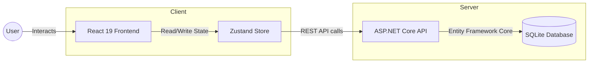
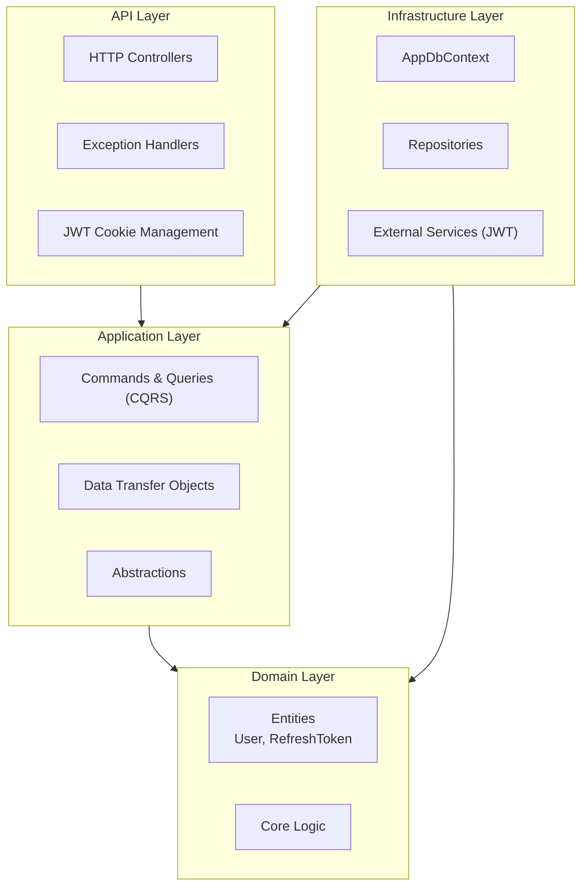
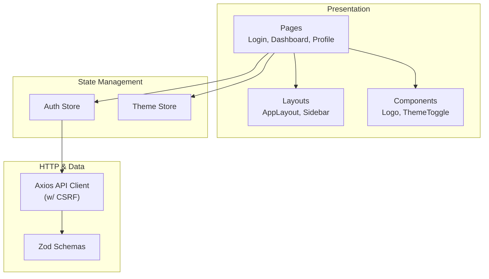
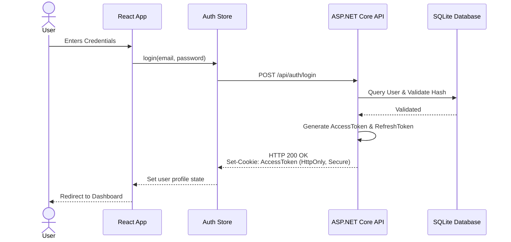
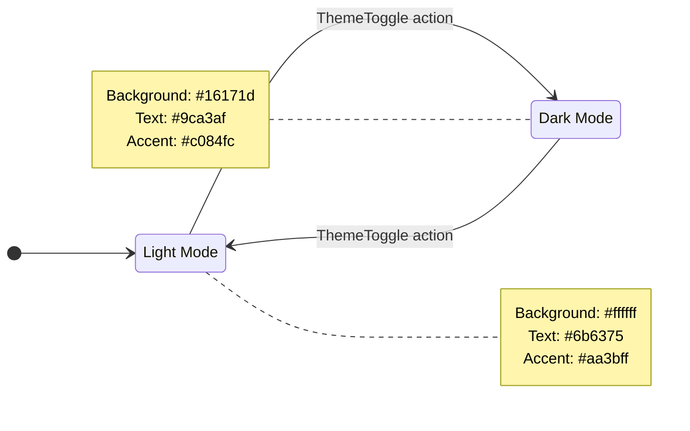

# Duschner Consulting Architecture Diagrams

This document outlines the system, frontend, backend, and security architectures for the Duschner Consulting application.

## 1. High-Level System Architecture

## 2. Backend Clean Architecture

Following a strict separation of concerns, the backend is structured into four main layers to decouple business logic from infrastructure and framework concerns.

## 3. Frontend Architecture

The React-based frontend is modularized for clarity, separating pages, layout structure, state stores, and base components.

## 4. Authentication Integration Flow

This sequence demonstrates the full flow from user interaction in the React app through to the secure, HttpOnly cookie-based backend token generation.

## 5. Theme State Machine

Visualizes how the color mode is toggled within the frontend project and what implications it has on color variables.

