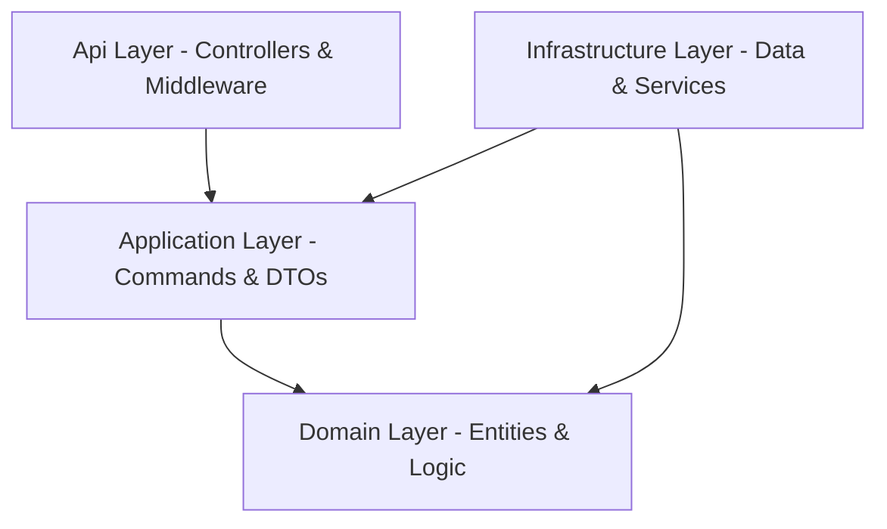
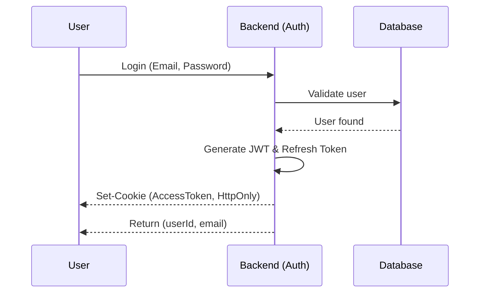

# Duschner Consulting - Backend Documentation

A robust authentication API built on **Clean Architecture** principles, designed with the highest security standards in mind.

## 🏗 Architecture

The project follows the Clean Architecture pattern to ensure a clear separation of concerns and high testability.

### 🧱 Layer Directory

| Layer | Purpose |
| :--- | :--- |
| **Api** | Entry point, HTTP controllers, JWT cookie management, and global exception handlers. |
| **Application** | Core business logic, CQRS handlers, interfaces (abstractions), and validation. |
| **Domain** | Pure domain entities (`User`, `RefreshToken`) and core logic without external dependencies. |
| **Infrastructure** | Database implementation (`AppDbContext`), repositories, and services like JWT generation. |

## 🛠 Technology Stack

- **Framework**: .NET 9.0 (ASP.NET Core)
- **Database**: SQLite (via Entity Framework Core)
- **Authentication**: JWT (JSON Web Tokens) with Refresh Token Rotation
- **Security**: 
  - HttpOnly & Secure Cookies for access tokens
  - CSRF/Antiforgery protection
  - Password hashing with BCrypt

## 🔑 Authentication Flow

The login process is designed to prevent XSS attacks by storing tokens in secure cookies.

## 🚀 Key Endpoints

- `POST /api/auth/login`: Logs the user in and sets the authentication cookie.
- `POST /api/auth/register`: Creates a new account.
- `GET /api/me`: Retrieves the identity of the currently logged-in user.
- `POST /api/auth/logout`: Clears session cookies.
