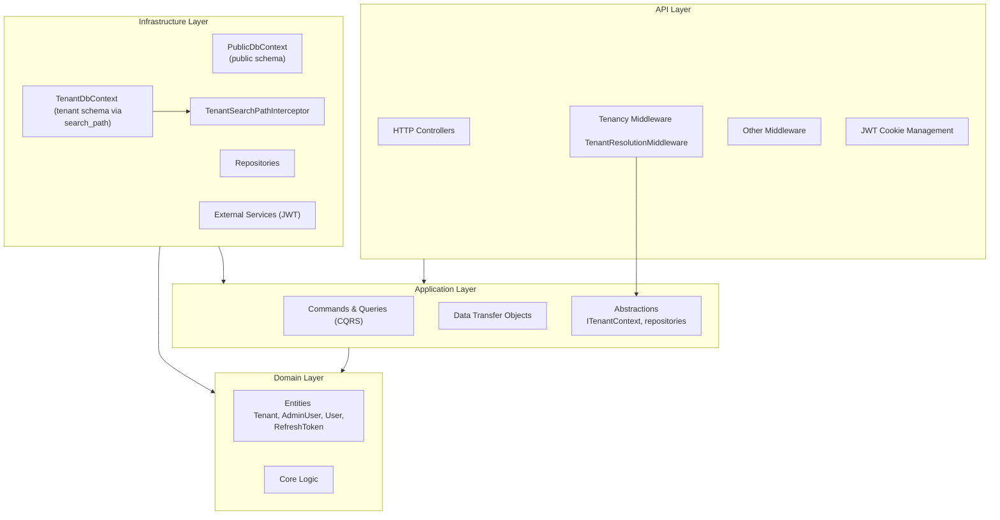
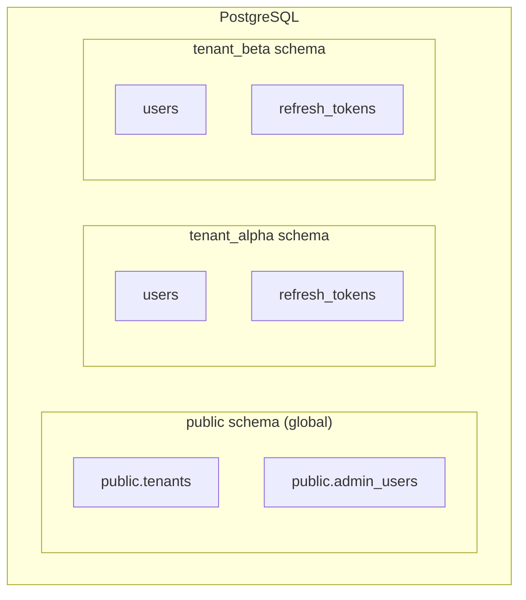
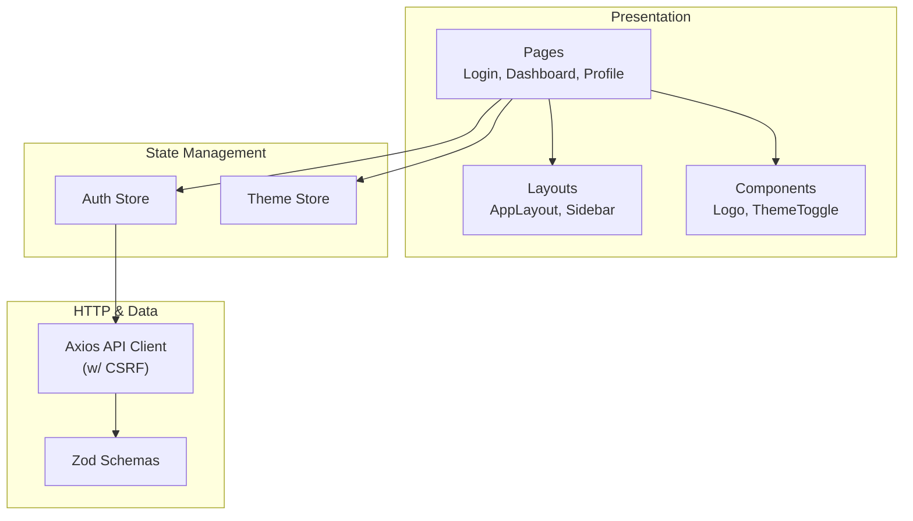
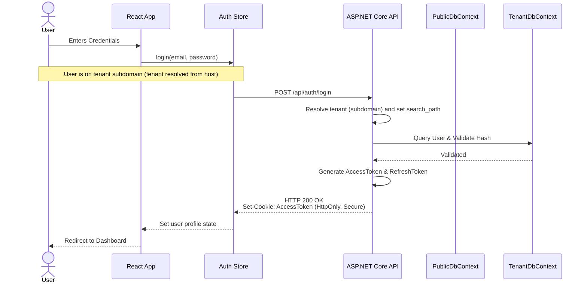
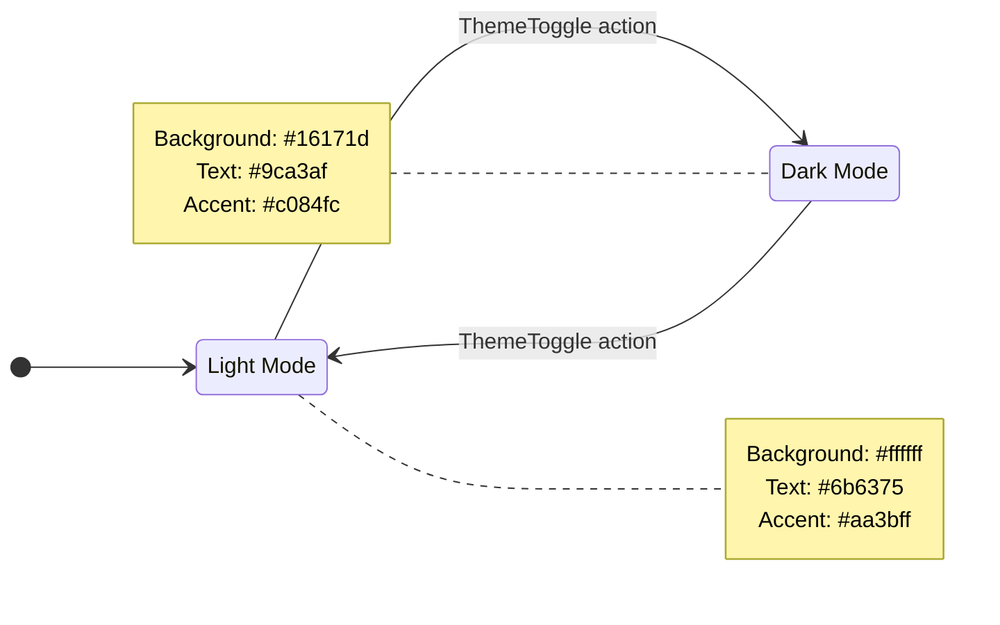

# Duschner Consulting Architecture Diagrams

This document outlines the system, frontend, backend, and security architectures for the Duschner Consulting application.

See also:
- `docs/ENGINEERING_GUIDELINES.md` (SOLID, Clean Architecture, React best practices)

## 1. High-Level System Architecture

```mermaid
graph LR
    subgraph Client
        UI["React 19 Frontend"]
        Zustand["Zustand Store"]
    end
    
    subgraph Server
        API["ASP.NET Core API"]
        PG[("PostgreSQL")]
    end
    
    User(("User")) -->|Interacts| UI
    UI -->|Read/Write State| Zustand
    Zustand -->|REST API calls| API
    API -->|EF Core (Npgsql)| PG
```

## 2. Backend Clean Architecture

Following a strict separation of concerns, the backend is structured into four main layers to decouple business logic from infrastructure and framework concerns.



## 3. Multi-Tenancy Data Model (Schemas)

Tenant isolation uses **PostgreSQL schema-per-tenant** with a small set of global tables in `public`.



## 4. Frontend Architecture

The React-based frontend is modularized for clarity, separating pages, layout structure, state stores, and base components.



## 5. Authentication Integration Flow

This sequence demonstrates the full flow from user interaction in the React app through to the secure, HttpOnly cookie-based backend token generation.



## 6. Theme State Machine

Visualizes how the color mode is toggled within the frontend project and what implications it has on color variables.



