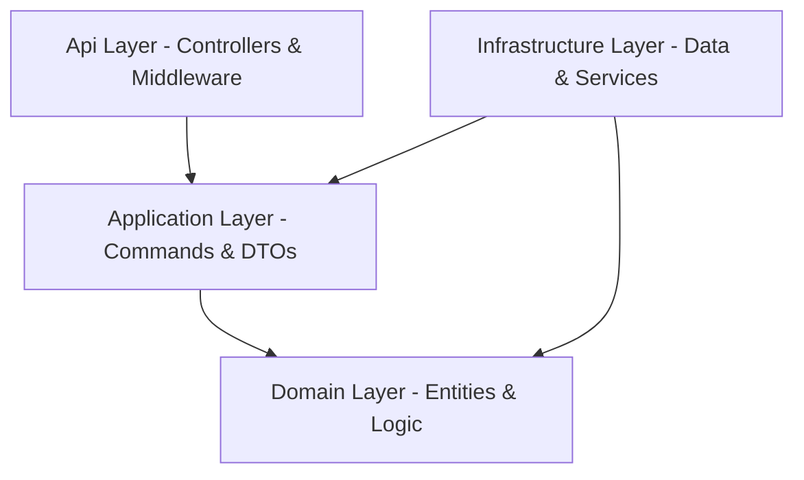
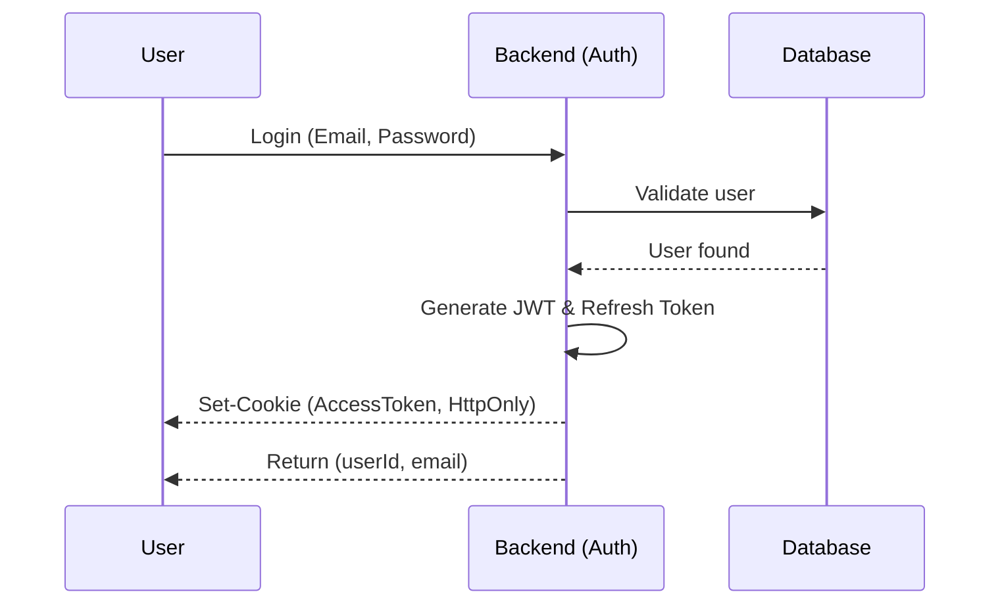

# Duschner Consulting - Backend Documentation

A robust authentication API built on **Clean Architecture** principles, designed with the highest security standards in mind.

See also:
- `docs/ENGINEERING_GUIDELINES.md` (SOLID + Clean Architecture conventions + multi-tenancy rules)

## 🏗 Architecture

The project follows the Clean Architecture pattern to ensure a clear separation of concerns and high testability.

### 🧱 Layer Directory

| Layer | Purpose |
| :--- | :--- |
| **Api** | Entry point, HTTP controllers, JWT cookie management, and global exception handlers. |
| **Application** | Core business logic, minimal CQRS command handlers (no external package), interfaces (abstractions), and validation. |
| **Domain** | Pure domain entities (`User`, `RefreshToken`) and core logic without external dependencies. |
| **Infrastructure** | Database implementation (`PublicDbContext` + `TenantDbContext`), repositories, and services like JWT generation. |

## 🛠 Technology Stack

- **Framework**: .NET 9.0 (ASP.NET Core)
- **Database**: PostgreSQL (via Entity Framework Core + Npgsql)
- **Authentication**: JWT (JSON Web Tokens) with Refresh Token Rotation
- **Validation**: FluentValidation (project standard)
- **Security**: 
  - HttpOnly & Secure Cookies for access tokens
  - CSRF/Antiforgery protection
  - Password hashing with BCrypt
  - Tenant-bound authorization (`tenant_slug` claim must match resolved tenant)
  - Host suffix allowlist in tenant-resolution middleware
  - One-time password reset tokens (time-limited)

## 🧩 Multi-Tenancy Overview

- **Tenant resolution**: subdomain-based (e.g. `tenant1.example.com`)
- **Isolation**: schema-per-tenant in PostgreSQL
- **DbContexts**:
  - `PublicDbContext`: global tables in `public` (`tenants`, `admin_users`)
  - `TenantDbContext`: tenant tables via `search_path` (`users`, `refresh_tokens`)
- **Per-request schema selection**:
  - `TenantSearchPathInterceptor` sets `search_path` to `"<tenant_schema>", public`
- **Tenant lifecycle**:
  - `tenants.expires_at` is required
  - tenant resolution/auth only succeeds for `is_active = true` and `expires_at > now(UTC)`

## 🔑 Authentication Flow

The login process is designed to prevent XSS attacks by storing tokens in secure cookies.

## 🚀 Key Endpoints

- `POST /api/auth/login`: Logs the user in and sets the authentication cookie.
- `POST /api/auth/register`: Creates a new account.
- `GET /api/me`: Retrieves the identity of the currently logged-in user (**includes role + perms**).
- `POST /api/auth/logout`: Clears session cookies.
- `POST /api/auth/reset-password`: Consumes a one-time reset token and sets a new password.

### Admin endpoints

- `POST /api/admin/auth/login`: Admin login (sets access token cookie, `role=admin`)
- `GET /api/admin/auth/me`: Admin session check
- `GET /api/admin/tenants`: List tenants (admin policy)
- `POST /api/admin/tenants`: Create tenant + provision schema + apply tenant migrations (admin policy)
- `GET /api/admin/tenants/{tenantSlug}/users`: List users in a tenant schema (admin policy)
- `POST /api/admin/tenants/{tenantSlug}/users`: Create user in a tenant schema (admin policy)
- `POST /api/admin/tenants/{tenantSlug}/users/{userId}/reset-password`: Issues one-time reset token/link (no plaintext temp password response)

## 🛡 Security Notes

- Admin login verification now includes a dummy hash path for unknown emails to reduce account-enumeration timing signals.
- Password reset now uses one-time signed tokens with a short expiry window instead of returning temporary plaintext passwords.
- Tenant-scoped policies enforce `tenant_slug` claim matching against resolved tenant context.
- Tenant expiration is enforced in tenant-resolution middleware to prevent login/access for expired tenants.

## 🔐 Authorization (Policies)

- **Admin**: requires claim `role=admin`
- **Tenant read/write**:
  - `tenant.read` requires `perm=tenant:read` (or `role=admin`)
  - `tenant.write` requires `perm=tenant:write` (or `role=admin`)
  - Both require a resolved tenant schema (`search_path` context)

