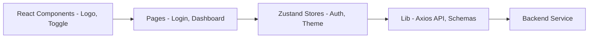
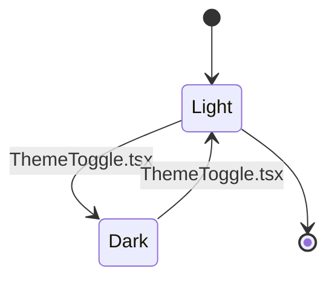
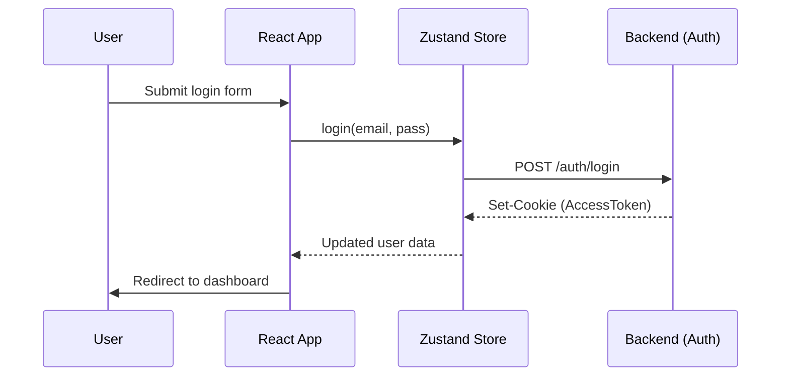

# Duschner Consulting - Frontend Documentation

The frontend of **Duschner Consulting** provides a responsive, localized (German), and high-performance user interface for authentication management.

See also:
- `docs/ENGINEERING_GUIDELINES.md` (React best practices + access control conventions)

## 🏗 Architecture

The frontend structure is designed for modularity and a clear separation of logic (Zustand) and view (React).

### 📁 Directory Structure

| Directory | Purpose |
| :--- | :--- |
| **components** | Reusable UI elements such as `Logo` and `ThemeToggle`. |
| **layouts** | Structural templates (`AppLayout` with Sidebar). |
| **pages** | View logic for `Dashboard`, `Profile`, `Login`, and `Registration`. |
| **store** | Global state (Zustand) for authentication and design variants. |
| **schemas** | Zod validation rules for forms and API responses. |

## 🛠 Technology Stack

- **Core**: React 19 + TypeScript
- **Styling**: Tailwind CSS v4.2.2 (Modern Utility-First CSS)
- **State Management**: Zustand (Lighter than Redux)
- **Routing**: React Router (v7)
- **API Client**: Axios with CSRF integration
- **Validation**: Zod (Type-safe forms)
- **Testing**: Vitest (project standard)

## 🎨 Design Philosophy

### Logo System
- **SVG-Based**: The logo (`Logo.tsx`) is a custom SVG defined in code, dynamically adapting to design themes.
- **Geometry**: Uses perfect half-circles with a 10-unit center gap (`|)(|`).
- **Adaptivity**: The logo scales and hides text when the sidebar is collapsed.

### Color Scheme (Themes)
The application supports full **Light/Dark Mode** switching.

| Mode | Background | Text | Accent |
| :--- | :--- | :--- | :--- |
| **Light Mode** | `#ffffff` | `#6b6375` | `#aa3bff` (Purple) |
| **Dark Mode** | `#16171d` | `#9ca3af` | `#c084fc` (Light Purple) |

## ⚡ Authentication Management

Authentication uses advanced browser security strategies such as HttpOnly cookies.

## 🔐 Access Control (UI)

The UI reads `role` and `perms` from the backend session (`GET /api/me`) and exposes a small helper hook:

- `frontend/src/hooks/useAccess.ts`
  - `isAdmin`
  - `canTenantRead`
  - `canTenantWrite`

These values can be used to:
- show/hide admin navigation and admin pages
- disable/hide write actions for read-only users

## 🛡 Security Notes

- AuthZ state is server-validated at runtime (`bootstrap`) and no longer persisted in `localStorage`.
- API errors are mapped to safe user-facing messages to avoid leaking backend internals.
- Unsafe HTTP requests auto-attach CSRF token, and on likely CSRF rejection the client refetches token once and retries automatically.
- Admin password reset now exposes a one-time reset link/token instead of a plaintext temporary password.
- Admin tenant provisioning requires an expiration date (`expiresAt`) and displays it in tenant management UI.

